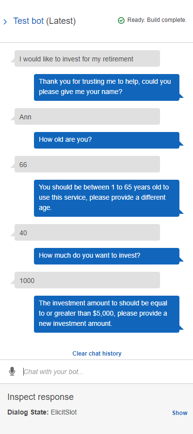
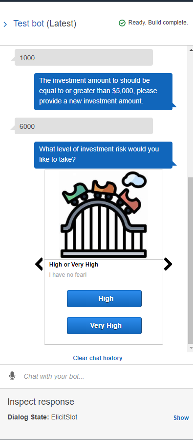
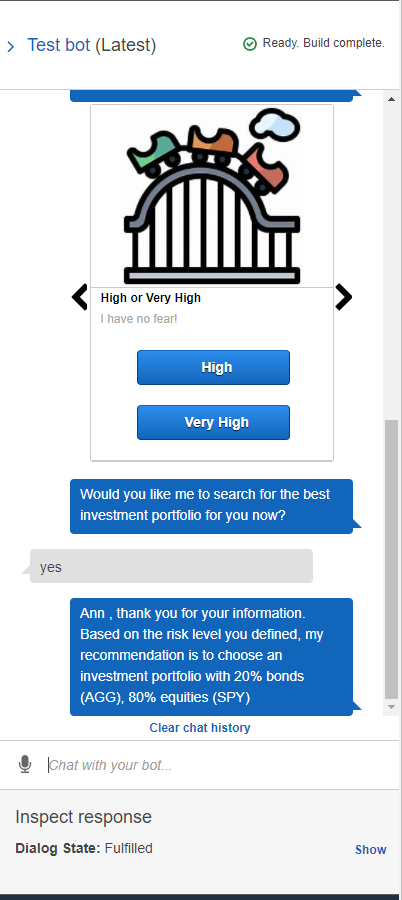

# AWS Homework #

## Robo Advisor for Retirement Plans ##

In this homework, I have used Amazon Web Services (Amazon Lex and Lambda) to create a bot called RoboAdvisor that will recommend an investment portfolio for a retirement plan.

In the Lambda function, I have used the following guidelines:

### User Input Validation ###

- The age should be greater than zero and less than 65.
- The investment amount should be equal to or greater than 5000.

### Investment Portfolio Recommendation ###

Based on the level of risk, the investment recommendation is as follows:

1. None: "100% bonds (AGG), 0% equities (SPY)"
2. Very Low: "80% bonds (AGG), 20% equities (SPY)"
3. Low: "60% bonds (AGG), 40% equities (SPY)"
4. Medium: "40% bonds (AGG), 60% equities (SPY)"
5. High: "20% bonds (AGG), 80% equities (SPY)"
6. Very High: "0% bonds (AGG), 100% equities (SPY)"

